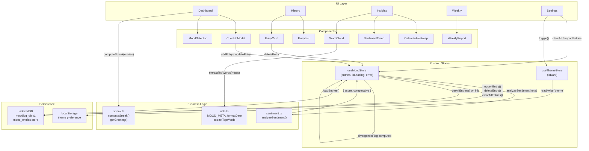
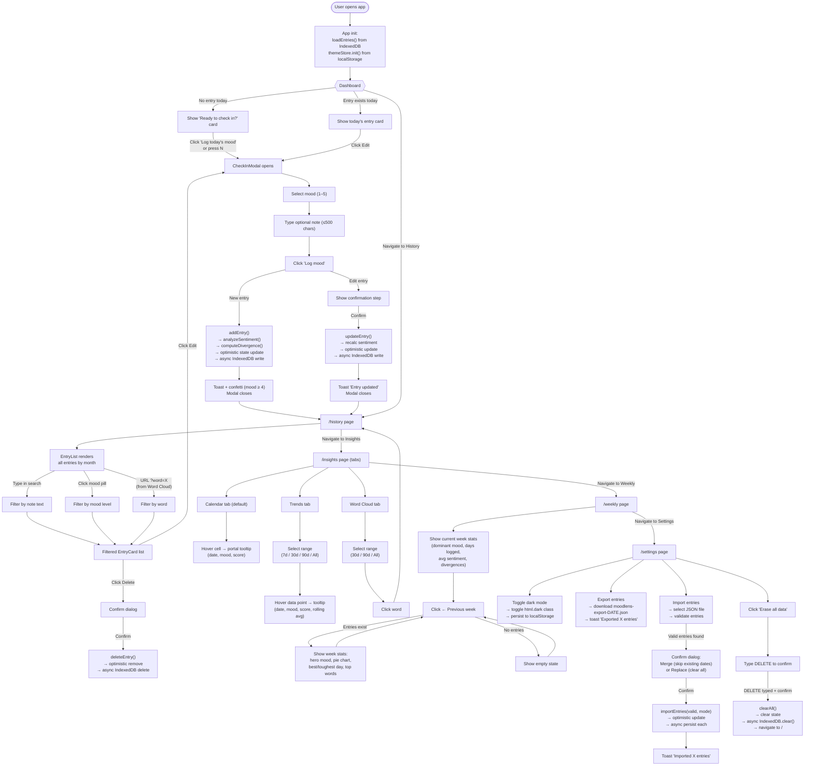

# MoodLens — Codebase Diagrams

## 1. Architecture Flowchart — Data Flow

```mermaid
flowchart TD
    subgraph UI["UI Layer"]
        Dashboard
        History
        Insights
        Weekly
        Settings
    end

    subgraph Components["Components"]
        CheckInModal
        MoodSelector
        EntryList
        EntryCard
        CalendarHeatmap
        SentimentTrend
        WordCloud
        WeeklyReport
    end

    subgraph Store["Zustand Stores"]
        MoodStore["useMoodStore\n(entries, isLoading, error)"]
        ThemeStore["useThemeStore\n(isDark)"]
    end

    subgraph Lib["Business Logic"]
        Sentiment["sentiment.ts\nanalyzeSentiment()"]
        Utils["utils.ts\nMOOD_META, formatDate\nextractTopWords"]
        Streak["streak.ts\ncomputeStreak()\ngetGreeting()"]
    end

    subgraph DB["Persistence"]
        IDB["IndexedDB\nmoodlog_db v1\nmood_entries store"]
        LS["localStorage\ntheme preference"]
    end

    %% UI → Components
    Dashboard --> CheckInModal
    Dashboard --> MoodSelector
    History --> EntryList
    History --> EntryCard
    Insights --> CalendarHeatmap
    Insights --> SentimentTrend
    Insights --> WordCloud
    Weekly --> WeeklyReport

    %% Components → Store (reads)
    CheckInModal -- "addEntry / updateEntry" --> MoodStore
    EntryCard -- "deleteEntry" --> MoodStore
    Settings -- "clearAll / importEntries" --> MoodStore
    Settings -- "toggle()" --> ThemeStore

    %% Store → Lib
    MoodStore -- "analyzeSentiment(note)" --> Sentiment
    Dashboard -- "computeStreak(entries)" --> Streak
    WordCloud -- "extractTopWords(notes)" --> Utils

    %% Store → DB
    MoodStore -- "upsertEntry()\ndeleteEntry()\nclearAllEntries()" --> IDB
    MoodStore -- "getAllEntries() on init" --> IDB
    ThemeStore -- "read/write 'theme'" --> LS

    %% DB → Store
    IDB -- "loadEntries()" --> MoodStore

    %% Sentiment flow detail
    Sentiment -- "{ score, comparative }" --> MoodStore
    MoodStore -- "divergenceFlag computed" --> MoodStore
```

---

## 2. Component Tree

```mermaid
flowchart TD
    App["App.tsx\n(Router + store init)"]

    App --> AppShell
    AppShell --> NavBar
    AppShell --> Routes

    Routes --> PgDash["Dashboard"]
    Routes --> PgHist["History"]
    Routes --> PgIns["Insights"]
    Routes --> PgWeek["Weekly"]
    Routes --> PgSet["Settings"]

    %% Dashboard subtree
    PgDash --> CTACard["CTACard\n(no entry today)"]
    PgDash --> TodayCard["TodayCard\n(entry exists)"]
    PgDash --> StatCard1["StatCard ×2\n(total, week count)"]
    PgDash --> CheckInModal

    CheckInModal --> MoodSelector["MoodSelector\n(5 emoji buttons)"]
    CheckInModal --> NoteArea["Textarea\n(max 500 chars)"]
    CheckInModal --> ConfirmStep["Confirmation step\n(edit only)"]

    %% History subtree
    PgHist --> EntryList
    EntryList --> SearchBar["Search input"]
    EntryList --> MoodFilters["Mood filter pills"]
    EntryList --> MonthGroups["Month-year headers"]
    EntryList --> EntryCard["EntryCard ×N"]
    EntryCard --> SentBadge["Sentiment badge"]
    EntryCard --> DivBadge["Divergence badge"]
    EntryCard --> EditBtn["Edit → CheckInModal"]
    EntryCard --> DelBtn["Delete → Confirm dialog"]

    %% Insights subtree
    PgIns --> TabNav["Tab nav\n(Calendar / Trends / Word Cloud)"]
    TabNav --> CalHeat["CalendarHeatmap\n(SVG 53×7 grid)"]
    TabNav --> SentTrend["SentimentTrend\n(Recharts composed chart)"]
    TabNav --> WCloud["WordCloud\n(D3 cloud)"]

    CalHeat --> Tooltip["Portal tooltip\n(date, mood, sentiment)"]
    SentTrend --> RangeBtn1["Range selector\n(7d / 30d / 90d / All)"]
    WCloud --> RangeBtn2["Range selector\n(30d / 90d / All)"]
    WCloud --> ClickNav["Click → /history?word=X"]

    %% Weekly subtree
    PgWeek --> WeeklyReport
    WeeklyReport --> WeekNav["Week navigator\n(← current week →)"]
    WeeklyReport --> HeroCard["Dominant mood hero"]
    WeeklyReport --> StatCards["StatCard ×3\n(days, avg sentiment, divergences)"]
    WeeklyReport --> PieChart["Pie chart + distribution bars"]
    WeeklyReport --> DayCards["DayCard ×2\n(best & toughest day)"]
    WeeklyReport --> TopWords["Top 3 word pills"]

    %% Settings subtree
    PgSet --> DarkToggle["Dark mode toggle\n(Sun ↔ Moon)"]
    PgSet --> ExportBtn["Export button\n(download JSON)"]
    PgSet --> ImportBtn["Import button\n(file input + dialog)"]
    PgSet --> EraseBtn["Erase button\n(type DELETE to confirm)"]
```

---

## 3. User Flow

```mermaid
flowchart TD
    Start(["User opens app"])
    Start --> AppInit["App init:\nloadEntries() from IndexedDB\nthemeStore.init() from localStorage"]
    AppInit --> Dashboard

    %% Dashboard branch
    Dashboard{{"Dashboard"}}
    Dashboard -- "No entry today" --> CTAState["Show 'Ready to check in?' card"]
    Dashboard -- "Entry exists today" --> TodayState["Show today's entry card"]
    CTAState -- "Click 'Log today's mood'\nor press N" --> ModalOpen

    TodayState -- "Click Edit" --> ModalOpen

    ModalOpen["CheckInModal opens"]
    ModalOpen --> SelectMood["Select mood (1–5)"]
    SelectMood --> TypeNote["Type optional note (≤500 chars)"]
    TypeNote --> ClickSave["Click 'Log mood'"]
    ClickSave -- "New entry" --> SaveNew["addEntry()\n→ analyzeSentiment()\n→ computeDivergence()\n→ optimistic state update\n→ async IndexedDB write"]
    ClickSave -- "Edit entry" --> ConfirmEdit["Show confirmation step"]
    ConfirmEdit -- "Confirm" --> SaveUpdate["updateEntry()\n→ recalc sentiment\n→ optimistic update\n→ async IndexedDB write"]
    SaveNew --> Feedback1["Toast + confetti (mood ≥ 4)\nModal closes"]
    SaveUpdate --> Feedback2["Toast 'Entry updated'\nModal closes"]

    %% History branch
    Feedback1 --> HistoryNav
    Feedback2 --> HistoryNav
    Dashboard -- "Navigate to History" --> HistoryNav

    HistoryNav["/history page"]
    HistoryNav --> ShowList["EntryList renders\nall entries by month"]
    ShowList -- "Type in search" --> FilterSearch["Filter by note text"]
    ShowList -- "Click mood pill" --> FilterMood["Filter by mood level"]
    ShowList -- "URL ?word=X\n(from Word Cloud)" --> FilterWord["Filter by word"]
    FilterSearch --> ShowFiltered["Filtered EntryCard list"]
    FilterMood --> ShowFiltered
    FilterWord --> ShowFiltered
    ShowFiltered -- "Click Edit" --> ModalOpen
    ShowFiltered -- "Click Delete" --> DelConfirm["Confirm dialog"]
    DelConfirm -- "Confirm" --> DeleteEntry["deleteEntry()\n→ optimistic remove\n→ async IndexedDB delete"]

    %% Insights branch
    HistoryNav -- "Navigate to Insights" --> InsightsNav

    InsightsNav["/insights page (tabs)"]
    InsightsNav --> TabCal["Calendar tab (default)"]
    InsightsNav --> TabTrend["Trends tab"]
    InsightsNav --> TabCloud["Word Cloud tab"]

    TabCal --> HoverCell["Hover cell → portal tooltip\n(date, mood, score)"]
    TabTrend --> SelectRange1["Select range\n(7d / 30d / 90d / All)"]
    SelectRange1 --> HoverChart["Hover data point → tooltip\n(date, mood, score, rolling avg)"]
    TabCloud --> SelectRange2["Select range\n(30d / 90d / All)"]
    SelectRange2 --> ClickWord["Click word"]
    ClickWord --> HistoryNav

    %% Weekly branch
    InsightsNav -- "Navigate to Weekly" --> WeeklyNav

    WeeklyNav["/weekly page"]
    WeeklyNav --> CurrentWeek["Show current week stats\n(dominant mood, days logged,\navg sentiment, divergences)"]
    CurrentWeek --> PrevWeek["Click ← Previous week"]
    PrevWeek -- "Entries exist" --> WeekStats["Show week stats:\nhero mood, pie chart,\nbest/toughest day, top words"]
    PrevWeek -- "No entries" --> EmptyWeek["Show empty state"]
    EmptyWeek --> PrevWeek
    WeekStats --> PrevWeek

    %% Settings branch
    WeeklyNav -- "Navigate to Settings" --> SettingsNav

    SettingsNav["/settings page"]
    SettingsNav --> DarkToggle["Toggle dark mode\n→ toggle html.dark class\n→ persist to localStorage"]
    SettingsNav --> Export["Export entries\n→ download moodlens-export-DATE.json\n→ toast 'Exported X entries'"]
    SettingsNav --> Import["Import entries\n→ select JSON file\n→ validate entries"]
    Import -- "Valid entries found" --> ImportDialog["Confirm dialog:\nMerge (skip existing dates)\nor Replace (clear all)"]
    ImportDialog -- "Confirm" --> ImportSave["importEntries(valid, mode)\n→ optimistic update\n→ async persist each"]
    ImportSave --> ImportToast["Toast 'Imported X entries'"]
    SettingsNav --> Erase["Click 'Erase all data'"]
    Erase --> EraseDialog["Type DELETE to confirm"]
    EraseDialog -- "DELETE typed + confirm" --> EraseAll["clearAll()\n→ clear state\n→ async IndexedDB.clear()\n→ navigate to /"]
```
